# Grundlagen zu InfluxDB2 + FluxQL

im folgenden sollen die Grundlagen und die folgenden Begriffe erklärt werden:
- Bucket
- Retention Time
- Measurement
- Field
- Value
- Tag
- Point
- Schema
- Task
- ...

Original Dokumentation unter [https://docs.influxdata.com/](https://docs.influxdata.com/)

Nach erfolgreicher Installation kann man die Webseite der InfluxDB unter dem Link https://<IP-InfluxDB-Server:8086/signin
erreichen. Zugangsdaten während der Installation

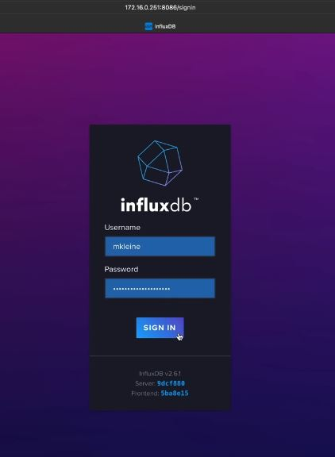

Verwaltung über die Browseroberfläche (neu in InfluxDB 2)

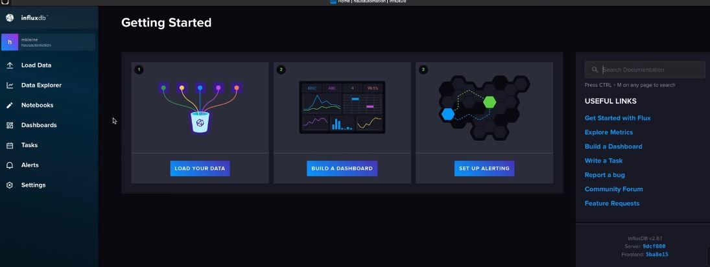

Man kann über diese Oberfläche auch **Dashboards** anlegen (eventuell Ersatz für Grafana)

## Buckets

unter **Load Data -> Buckets** sieht man 2 Systembuckets (_monitoring und _tasks) und ein während der Installation angelegtes Bucket

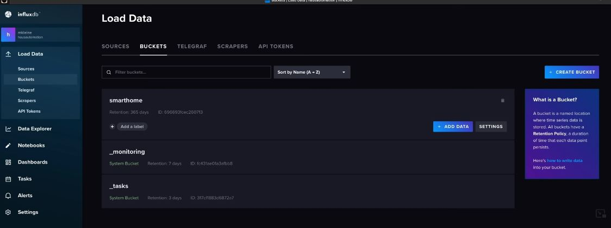

Je Bucket kann man eine sogenannte **Retension Time** konfigurieren. Beim Anlegen eines Buckets kann man auswählen
wann die Daten gelöscht werden sollen (z.B. Never oder Older Than 30 days oder ...). Die Retension Time kann bei
InfluxDB 2 nur je Bucket vergeben werden. Falls du Daten hast die nie gelöscht werden sollen und Daten die nach einer
bestimmten Zeit gelöscht werden sollen. brauchst du dafür verschiedene Buckets.

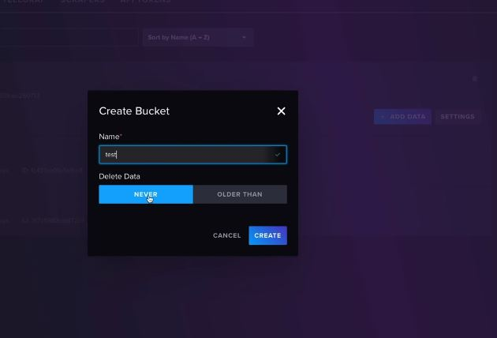

Nachdem man ein Bucket angelegt hat - wie bekommt man jetzt Daten in dieses Bucket?

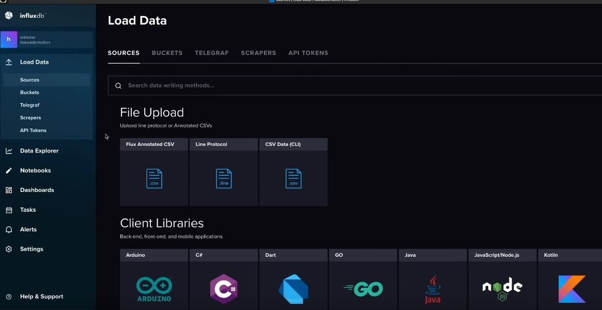

Es gibt verschiedene Möglichkeiten:
- File upload mit dem richtigen Format
- Client Libraries (Java, JavaScript, php, ...)
- Telegraf (eigene Anwendung, die in einem eigenen Prozess läuft - z.B. Daten aus Docker Umgebung, ...)

Daten über das Line Protocol: 
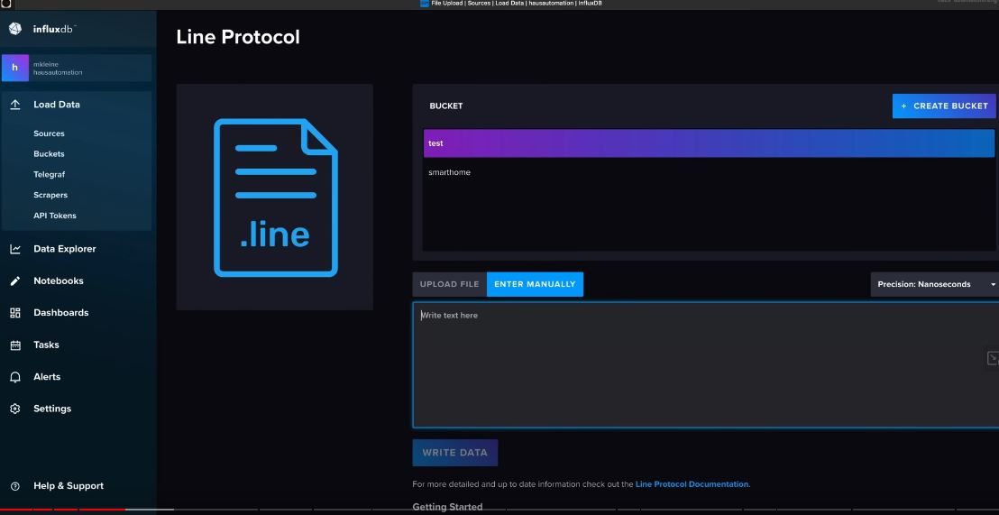

Eingabe natürlich im richtigen Format: 
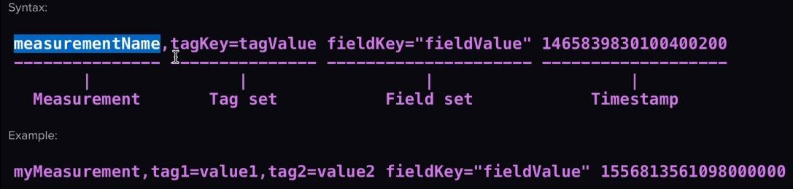

- Measurement Name (unbedingt notwendig)
- optionale Tags (durch Beistriche vom mesurement getrennt) - Metadaten
- einzelne Felder mit den Werten (durch Leerzeichen von den Tags getrennt) - auch mehrere Felder durch Beistriche getrennt
- zum Schluss der Timestamp (optional - ohne Angabe wird die Machinenzeit verwendet)

## Measurements

Beispiele:

**wetter temperatur=9.5**

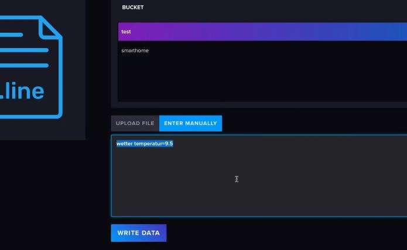

über den Data Explorer kann man sich die Daten gleich ansehen

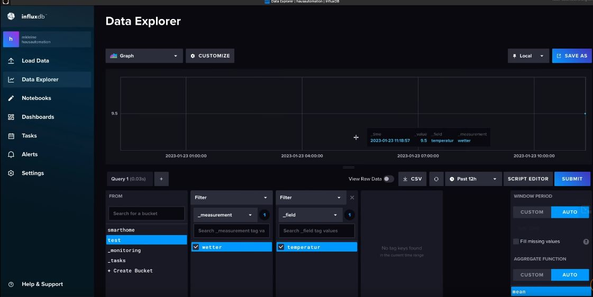

über die Aggregate Function kann man die Verläufe ändern (custom mean, ...)

in ein mesurement mehrere Werte speichern: 
**wetter luftfeuchte=60**

ein Measurement mit Tags erweitern: 
**wetter,stadt=Wien,land=at temperatur=13**

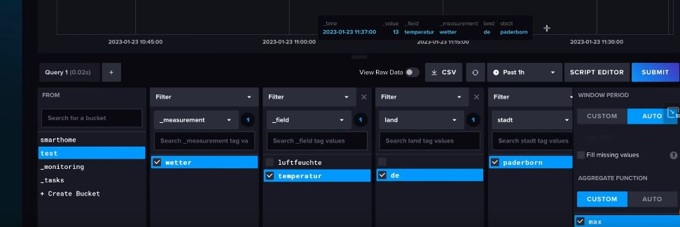

durch günstige Vergabe der Metadaten kann man später gut selektieren (z.B. Durchschnitt über ganz Österreich)

## Schema Design

viele Beispiele unter [https://docs.influxdata.com/influxdb/v2/write-data/best-practices/schema-design/][https://docs.influxdata.com/influxdb/v2/write-data/best-practices/schema-design/]

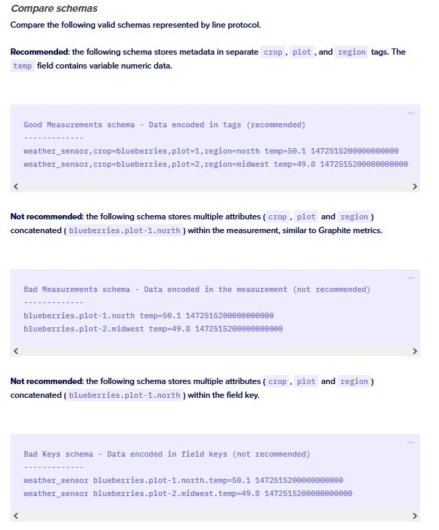

Nicht empfohlen ist, dass man die Daten im Measurementnamen einbezieht oder den Fieldnamen erweitert.

## Eingaben über ein http-API

Notwendig sind:
- API Token (wird bei der Installation generiert oder über Load Data -> API Tokens -> Generate API Token) 
  Achtung: Token wir nur einmalig bei der Generierung angezeigt !!!
- Organisation (über h -> About)
- Bucketname

Danach z.B. über curl einen POST-Request zusammenstellen 
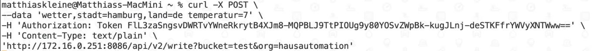

Ein solcher http-request kann mit fast allen Programmiersprachen zusammengestellt werden.

Um mehrere Werte mit einem Zeitstempel abzuspeichern: 
**wetter,stadt=Hamburg,land=de temperatur=7.5,luftfeuchte=50**

## Flux Query Language

Abfragesprache um Daten aus der Datenbank zu extrahieren (über die Weboberfläche - Data Explorer) schon indirekt verwendet

über den Script-Editor das generierte Script aus den Einstellungen einsehbar 
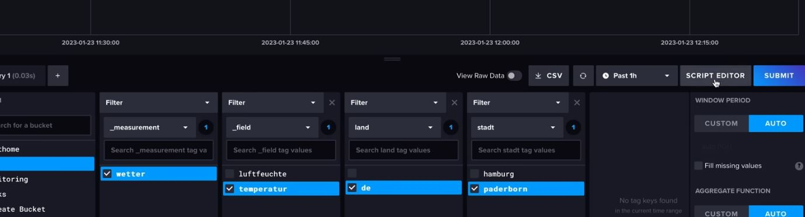

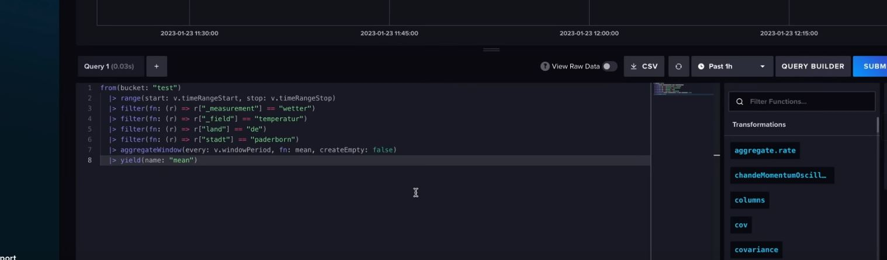

from   --> gibt an aus welchem Bucket die Daten kommen 
|      --> danach werden die Daten immer wie bei einer Pipe durchgereicht 
range  --> gibt den Zeitbereich an 
filter --> filtern nach den entsprechenden Bedingungen 
aggregateWindow --> Aggregation nach einem bestimmten Zeitraum (every -> Zeitraum; fn -> Funktion; createEmpty -> keine Leerzeilen) 
yield(name) --> erstellen eines neuen Felds mit dem Namen "mean"

Dokumentation unter: 
- [https://docs.influxdata.com/flux/v0/](https://docs.influxdata.com/flux/v0/)
- [https://docs.influxdata.com/flux/v0/stdlib/universe/filter/](https://docs.influxdata.com/flux/v0/stdlib/universe/filter/)

